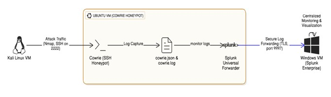
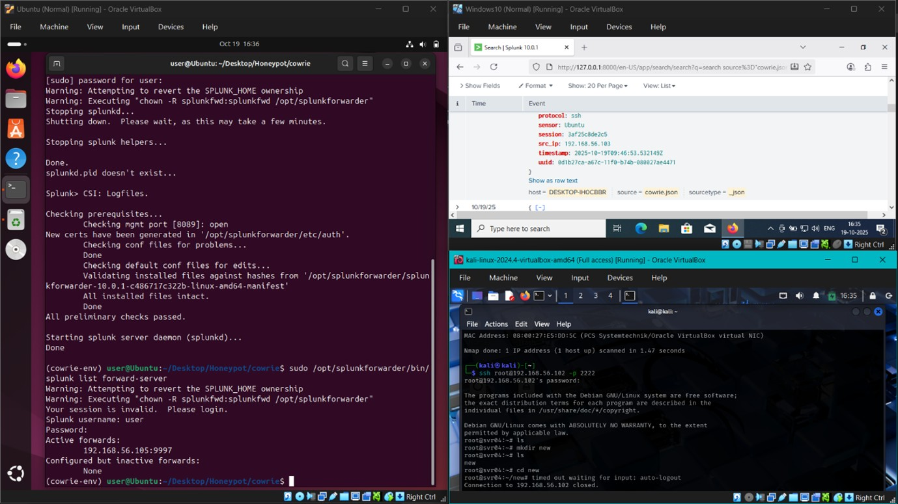
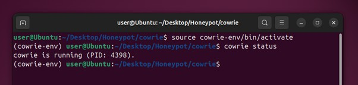
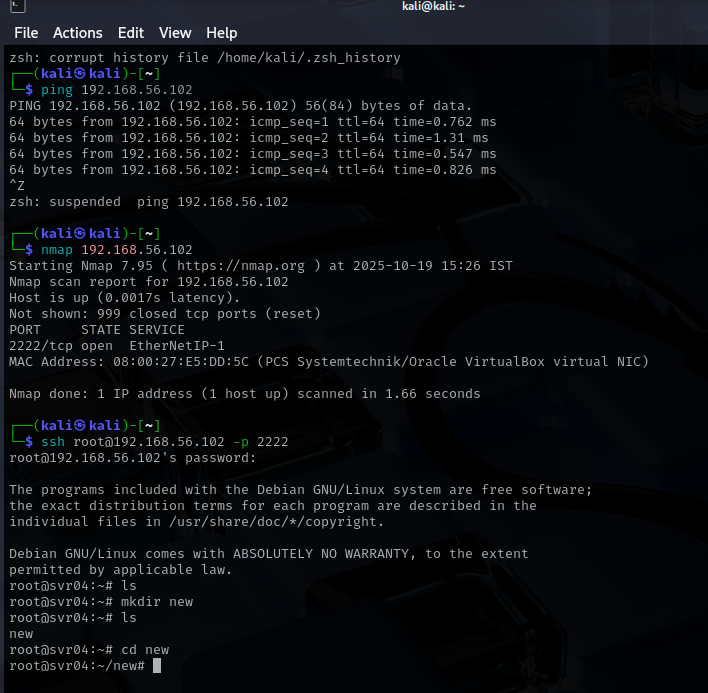
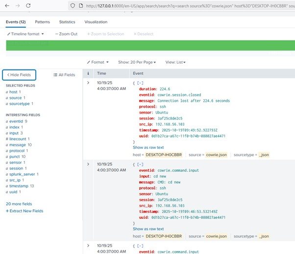

# Honeypot Attack Detection using Cowrie and Splunk

## Overview
Deployed a Cowrie SSH/Telnet honeypot on Ubuntu VM and forwarded 
captured attack logs to Splunk Enterprise via Universal Forwarder 
for centralized SIEM analysis. Simulated full attacker workflow 
from Kali Linux - recon to intrusion and validated detection.

## Architecture
Kali Linux (attacker) -> Ubuntu Cowrie Honeypot -> 
Splunk Universal Forwarder -> Splunk Enterprise (Windows)

## Tools Used
Cowrie, Splunk Enterprise, Splunk Universal Forwarder,
Kali Linux, Nmap, Ubuntu 22.04, VirtualBox

## Key Results
- Captured 12 events including Nmap scan probes and SSH sessions
- Logged attacker source IP, username used, and session duration
- Validated full SOC workflow: recon -> capture -> forward -> analyze

## Screenshots

## File in This Repo
- [Project Report](Honeypot.pdf)
